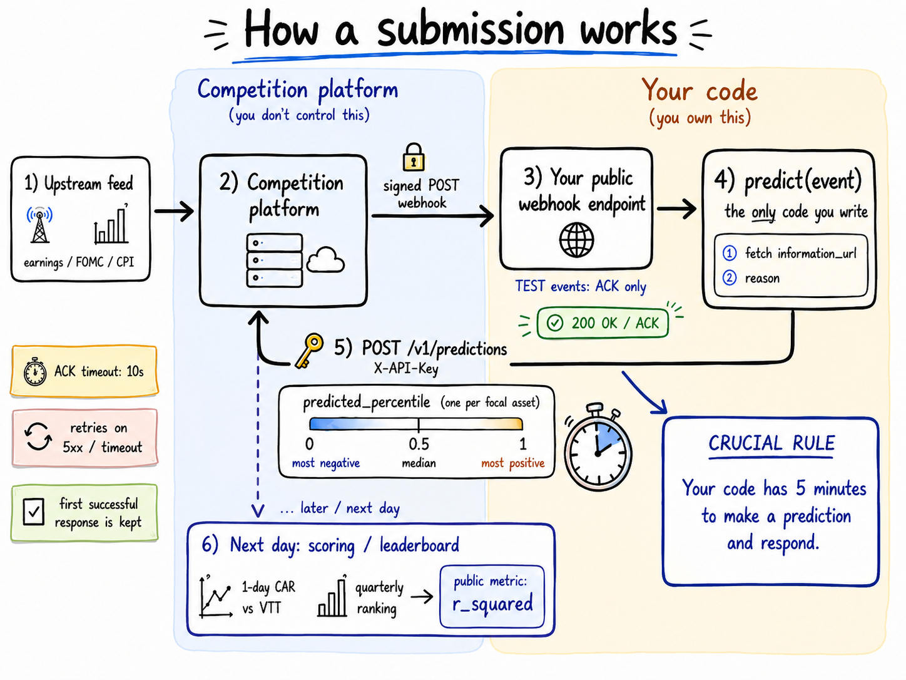

# Explaining Markets — earnings-reaction predictor

<p align="center">
  
</p>

A live, deployed prediction system for the [Explaining Markets](https://explainingmarkets.ai/)
competition: given a company's earnings event, predict where its next-day market-adjusted
stock reaction will rank against every other reaction that quarter (a percentile in `[0, 1]`).
Built on top of the official [Modal](https://modal.com) starter template — the webhook/signing/
deployment plumbing is the vendor's, everything under **What I built** below is mine.

Runs as a signed webhook receiver on Modal: the competition platform delivers an event,
the app verifies and ACKs it, then predicts and submits the result — all within a 5-minute
window, unattended, 24/7.

Built with AI-assisted development (Claude, via Claude Code) across many sessions —
for implementation, debugging, and working through the statistics behind the validation
methodology. The signal selection, prompt design, and interpretation of the results are mine.

## What I built

`predict.py` (the live predictor, submission "Frankfurt-2.2") combines:

- **LLM ensemble** — [GLM-5.2](https://docs.z.ai/guides/llm/glm-5.2) queried via structured
  tool-calling, `N_ENSEMBLE_DRAWS` concurrent draws averaged to reduce single-call sampling
  noise (`temperature=1` makes any one draw noisy on its own).
- **A self-improving rulebook** — `ace/` implements an offline Generator → Reflector →
  Curator loop (`ace/train.py`) that mines a training quarter's actual outcomes for
  recurring prediction mistakes, drafts short "rules of thumb" bullets, deduplicates and
  curates them, and gates each epoch against a held-out validation quarter before writing
  `rulebook.json`. The live predictor loads this file at call time — nothing adapts online,
  since the contest's 5-minute deadline leaves no room for a live Reflector/Curator pass.
  See [`docs/ace_architektur.html`](docs/ace_architektur.html) for the full loop diagram.
- **Alternative-data signals**, fetched once per event and shared across all ensemble draws:
  - **SEC EDGAR Form 4 insider activity** (`data_provider/sec_edgar.py`) — pulls a company's
    recent insider buy/sell filings straight from EDGAR's submissions API, parses the raw
    filing XML (not the misleading XSLT-rendered HTML view `primaryDocument` points to) for
    transaction codes, and summarizes open-market buys vs. sells with role and dollar value.
  - **EPS surprise** (`data_provider/finnhub.py`) — actual-vs-consensus earnings surprise for
    the ticker's most recent quarter. Chosen over FMP's equivalent endpoint, whose free tier
    turned out to only serve a fixed whitelist of ~15 blue-chip tickers (confirmed live via
    402 responses on unlisted names).
- **A controlled offline validation harness** (`02_validation.ipynb`, `examples/validate.py`),
  built on top of the vendor's `examples.scoring` utilities rather than from scratch —
  runs multiple model variants across the *same* held-out event sample and quarter, several
  independent trials each, scored with an unimputed ΔR² (the imputed, officially-ranked
  metric dilutes a fair, equal-coverage local A/B with thousands of mean-filled rows —
  see [`docs/doc.html`](docs/doc.html) for the full metric writeup). This is also how the
  project's honest limitation surfaced: at this sample size (~100 events/quarter), the gap
  between model variants is frequently within run-to-run sampling noise, which shaped which
  signals were kept and which were dropped rather than chased.

## Architecture

```
predict.py                 ← live predictor: GLM-5.2 + dynamic rulebook + insider/EPS signals
variants/                  ← comparison variants used to isolate one variable at a time
  predict_02.py, predict_mc_02.py    (static vs. dynamic rulebook, same prompt otherwise)
  predict_first.py                   (bare-minimum baseline: no rulebook, no extra signals)
submissions/                ← frozen snapshot of an earlier, actually-submitted variant
ace/                        ← offline rulebook training loop (Generator/Reflector/Curator)
data_provider/              ← SEC EDGAR, Finnhub, FMP, yfinance signal fetchers
rulebook.json               ← current trained rulebook, loaded by predict.py at call time
modal_app.py                ← FastAPI webhook handler + Modal deployment (vendor plumbing)
src/explaining_markets/     ← config, webhook verifier, API client (vendor plumbing)
01_historical_archive.ipynb ← offline backtesting against the historical event archive
02_validation.ipynb         ← controlled A/B validation across predictor variants
tests/                      ← predict() shape tests + webhook signature verification
```

When an event fires, the competition sends a **signed webhook**. This app verifies the
signature and ACKs within 20 seconds, then calls `predict(event)` and POSTs the result back
in the background — slow model calls happen after the ACK, never before it, so a large
reasoning-heavy LLM call never risks missing the delivery deadline.

---

## Prerequisites

This repo uses [uv](https://docs.astral.sh/uv/) — install it from the
[uv installation guide](https://docs.astral.sh/uv/getting-started/installation/).

> **Prefer pip?** Run `python -m venv .venv && source .venv/bin/activate && pip install -e ".[dev]"`
> instead of `uv sync`, and drop the `uv run` prefix from every command below.

## Quickstart

### 0. Install and sign in to Modal

```bash
uv sync
```

If you're new to Modal, create a free account and authenticate (one time — skip if
you already have a Modal token on this machine):

```bash
uv run modal setup
```

### 1. Create an account and your first submission

Go to [Explaining Markets](https://portal.explainingmarkets.ai) and click
**Sign in** at the top right, then **Create an account**, and complete the
sign-up flow.

Once you're in, create a submission from the
[Submissions](https://portal.explainingmarkets.ai/submissions) page and
give it a public name. You'll land on its **Overview** tab, which has a
**Setup checklist** that walks you through the rest:

> **Credentials → Webhook URL → Submission is live → Verify your endpoint works**

The next steps map onto that checklist; the submission goes live automatically once
the first two are done.

### 2. Initialize credentials (checklist: *Credentials*)

Click **Initialize credentials** (the checklist's first item) to mint your **API
key** and **webhook signing secret**. A dialog shows them **once**, under the
heading *"Ready to paste into .env"*, already formatted — exactly the two lines this
starter needs:

> `EM_API_KEY=...`
>
> `EM_WEBHOOK_SECRET=whsec_...`

Click **Copy** (the dialog won't let you continue until you do) — you won't see
these again, so don't close it before the next step. (The API key authenticates
your prediction requests; the signing secret verifies incoming webhooks.)

**Note:** If you ever need new credentials — e.g., because they were accidentally
leaked — that same item becomes **Replace credentials**. Clicking it mints a new set
you can use to continue from **Step 3**.

### 3. Put your credentials in `.env`

Create your `.env` from the template, then paste the copied box into it, replacing
the two placeholder lines:

```bash
cp .env.example .env
```

That's the whole secret setup — Modal reads `.env` automatically at deploy time, so
there's no command to run. (`.env` is gitignored; never commit it. This project also
needs `ZAI_API_KEY` for GLM-5.2, and optionally `FINNHUB_API_KEY` for the EPS-surprise
signal — see `.env.example`.)

### 4. Deploy

```bash
uv run modal deploy modal_app.py
```

Modal prints a persistent public URL like
`https://<your-workspace>--explaining-markets.modal.run`. **That URL is your webhook
URL — copy it as-is, nothing to append.** The deployment keeps running after you
close your laptop.

### 5. Set your webhook URL, go live, and verify

Back on the Overview checklist, do **Webhook URL**: paste the URL from the previous
step (it must be reachable over HTTPS in production; `http://` is allowed in dev)
and click **Save webhook URL**. As soon as credentials and a URL are both set,
**Submission is live** flips on automatically — no extra action.

The last item, **Verify your endpoint works**, is optional but strongly
recommended. Click **Send test event** to send a synthetic delivery. Your
handler verifies it, sees `event_type == "TEST"`, submits a neutral 0.5
prediction back (test predictions are never scored), and ACKs with 200; the
checklist confirms your endpoint responded and your prediction came back. If
nothing appears right away, check the **Health** tab for rolling delivery
counters.

### 6. `predict.py`

`predict(event)` is called once per event after verification; return one prediction per
focal asset:

```python
def predict(event: dict) -> list[dict]:
    return [
        {"identifier_value": "AAPL", "predicted_percentile": 0.92},
    ]
```

`predicted_percentile` is a float in `[0, 1]` — a prediction of how the asset's next-day
abnormal (market-adjusted) return will rank across **all of the quarter's event outcomes**:
0 = the quarter's most negative reaction, 0.50 = median, 1 = its most positive. It's a
cross-sectional rank across the quarter's events, *not* a percentile within the asset's own
history.

Re-deploy after editing:

```bash
uv run modal deploy modal_app.py
```

Only your first submission for an event is scored — re-POSTing the same event is
accepted but won't overwrite it.

---

## Rules & knowledge cutoff

Every event on the calendar (`GET /v1/events`) carries a `knowledge_cutoff`:
the predictor must not use any information from after that instant. The value is
an ISO 8601 date-time in UTC (e.g. `2026-01-13T21:00:00Z`). The event payload
delivered to the webhook describes the event itself and is fair game. Subject
to that cutoff, there are no restrictions on data sources, models, or tools.
Full rules live in the [FAQ](https://explainingmarkets.ai/faq).

---

## Run the tests

```bash
uv run pytest
```

Both suites run fully offline — no API key, no network. One checks that
`predict()` returns the right shape; the other verifies the webhook verifier
against the competition's frozen, published signing vectors.

---

## Troubleshooting

Webhook signatures cover the **exact bytes** the server sent. The most common
mistakes (all handled correctly by `modal_app.py`, but worth knowing if you
customize it):

- **Re-serializing the body before verification.** `json.dumps(json.loads(body))`
  reorders keys and adds spaces — verification fails. Always verify the raw bytes.
- **Using `request.json()` instead of `request.body()`.** Same issue: the parsed
  dict is no longer the original byte string. The handler reads `await
  request.body()`.
- **Ignoring the timestamp.** The verifier defaults to a 5-minute tolerance. If
  your clock drifts, pass `tolerance_seconds=` to `verify_webhook`.
- **Not deduping on `Webhook-Id`.** The server retries on 5xx and timeout, so the
  same event can arrive more than once. This app dedupes via a `modal.Dict`.

If predictions aren't landing: confirm your `.env` has `EM_API_KEY` and
`EM_WEBHOOK_SECRET` filled in (then re-deploy so Modal reloads it), that the
submission shows as live (the checklist's **Submission is live** item), and that
you pasted the deploy URL into the portal. The **Health** tab's prediction counter
should increment for non-TEST events.

If `modal deploy` errors that it can't find `.env`, you're missing the file —
`cp .env.example .env` and fill it in. Modal needs it present at deploy time.

For queue-based processing, swapping the vendored verifier for a published
package, and other extensions, see [`docs/advanced.md`](docs/advanced.md).

---

## Attribution

Built on the official [Explaining Markets Modal starter](https://explainingmarkets.ai/)
(webhook handling, signature verification, Modal deployment plumbing, and the vendored
`examples/` package for archive access and contest scoring utilities). Per the
[contest rules](https://explainingmarkets.ai/contest-rules), participants retain ownership
of their own models, prompts, and source code.
